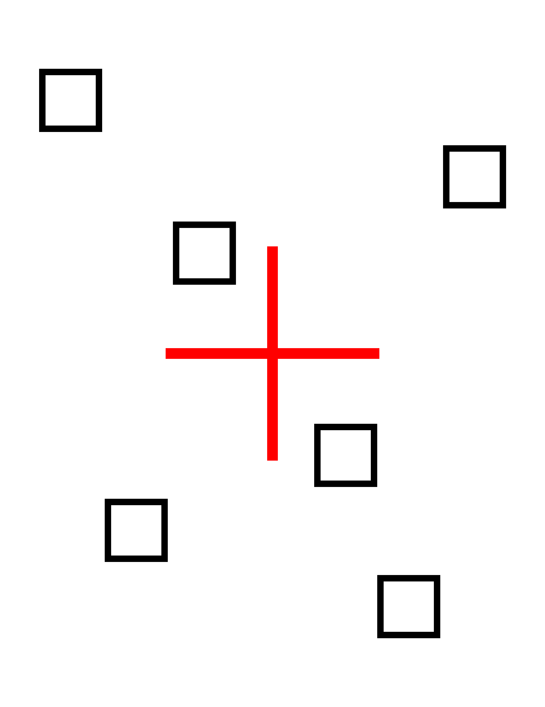
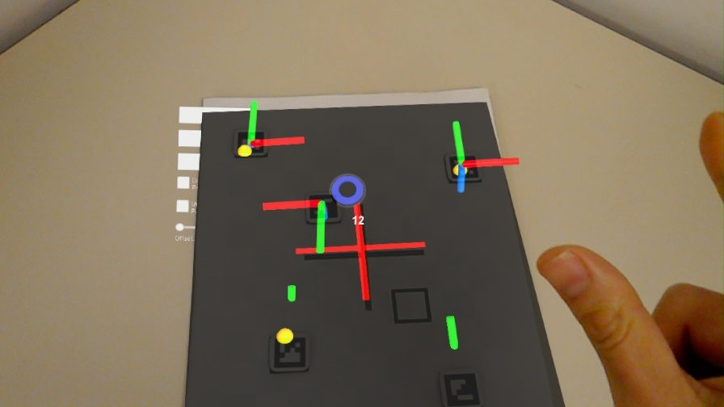
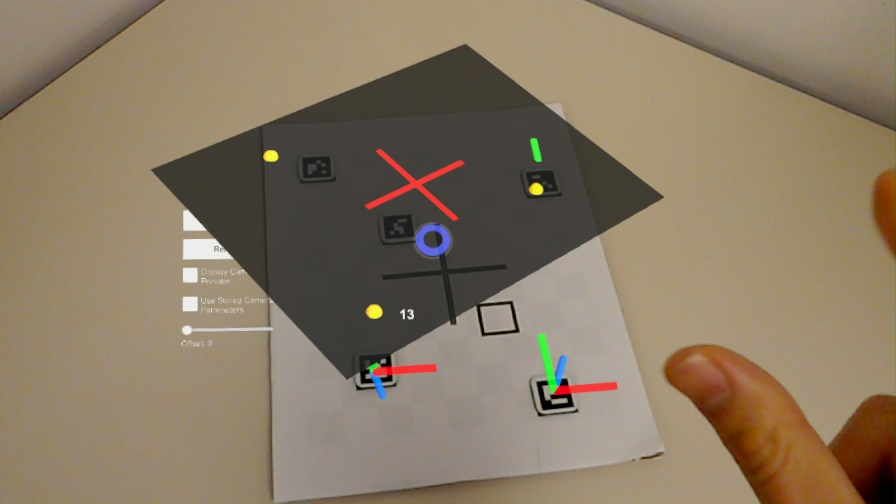
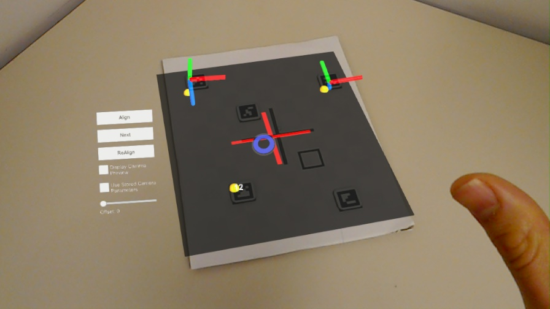

# AR Surgery

## Getting Started

### Prerequisites

1. Hololens 1
2. Windows 10 Pro
3. Windows 10 SDK 10.0.17134
4. Microsoft Visual Studio 15.9.11 - Go to `Help -> About Microsoft Visual Studio`, and check that the following products are installed:
    * C# tools
    * Visual Studio Tools for Unity
    * Visual Studio Tools for Universal Windows Apps
5. [Unity Editor 2018.3.14f1](https://unity3d.com/get-unity/download) - The main game engine
6. [HoloToolkit 2017.4.3.0](https://github.com/microsoft/MixedRealityToolkit-Unity/releases/tag/2017.4.3.0-Refresh) - This should be contained in the Unity package. If not, just download it from github.
7. [HololensCameraStream](https://github.com/VulcanTechnologies/HoloLensCameraStream) - This should be contained in the Unity package. If not, just download it from github.
8. [OpenCV for Unity](https://assetstore.unity.com/packages/tools/integration/opencv-for-unity-21088?aid=1011l4ehR&utm_source=aff) 2.3.3+

### Installation

#### Project Settings

After a proper installation, the project settings should be set as follows:

* Build Settings (File > Build Settings) and Other Settings (File > Build Settings > Player Settings ... > Other Settings)

    

* Publishing Settings (File > Build Settings > Player Settings ... > Publishing Settings)

    

* XR Settings (File > Build Settings > Player Settings ... > XR Settings)

    

* File Structure

    

#### Install From Unity Package

If directly openining the Unity project is not successful, then you can also create a new project and import all the packages manually.

1. Open Unity Hub and create a new project for Unity 2018.3.14f1.

    
2. Download and import (Assets > Import Package > Custom Package) the HoloToolkit-Unity-2017.4.3.0.unitypackage.
3. Setup the Holotoolkit (Mixed Reality ToolKit > Configure > Apply Mixed Reality Project Setting > Apply).
4. Import OpenCVForUnity (Asset Store > Search "OpenCVForUnity" > Import).
    * Setup the OpenCVForUnity (Tools > OpenCVForUnity > Set Plugin Import Settings)
    * Move the "OpenCVForUnity/StreamingAssets/haarcascade_frontalface_alt.xml" and "OpenCVForUnity/StreamingAssets/lbpcascade_frontalface.xml" to the "Assets/StreamingAssets/" folder.
5. Clone [HoloLensCameraStream](https://github.com/VulcanTechnologies/HoloLensCameraStream) repository.
    * Copy the "HoloLensCameraStream/HoloLensVideoCaptureExample/Assets/CamStream/" folder to the "Assets/" folder.
    * Set the scripting backend of the plugin inspector to "Any Script Backend". (IL2CPP support).
6. Import the HoloLensCameraTest.unitypackage.
7. Add the "Assets/HoloLensWithOpenCVForUnityExample/HoloLensArUcoExample/HololensAprilTag.unity" file to the "Scenes In Build" list in the "Build Settings" window.
    https://docs.microsoft.com/en-us/windows/mixed-reality/holograms-100
8. Set "IL2CPP" to "Other Settings > Configuration > Scripting Backend" selector in the "Player Settings" window.
9. Add "WebCam" to "Publishing Settings > Capabilities" checklist in the "Player Settings" window.
10. Build and Deploy to HoloLens. ([Tutorial](https://docs.microsoft.com/en-us/windows/mixed-reality/holograms-100))
11. Give Hololens the permission to use webcam.

# Tests

* Make sure that you can see a small window that displays the webcam texture on the top left corner of the Hololens.
* Print out on an US-Letter paper the following pattern, and attach the AprilTags onto the corresponding black boxes.

    

* Focus your gaze at the AprilTags, and make sure you see 3D axes appear on each AprilTag. Then hit the "Align" button, to see a pattern emerge on the AprilTags. You should see the following screenshot:

    

* If the alignment is incorrect, you can correct it by hitting the "Next" button to find another alignment.

    Before:

    

    After:

    

# Core Algorithms

Most of the core algorithm is contained in function Assets > HoloLensWithOpenCVForUnityExample > HoloLensArUcoExample > HoloLensAprilTag.cs

## AprilTag Detection

`OnFrameMatAcquired`:
* When a frame `Mat bgraMat` arrives, this function detects the marker in this frame by calling `Aruco.detectMarkers` to obtain the location of the markers in the image frame. Then the function converts the position on the image frame to a position in the world frame by calling the function `Aruco.estimatePoseSingleMarkers`. Among other things, this function requires the camera parameters `camMatrix` and `distCoeffs`. To learn more about this function, read the [documentation](https://docs.opencv.org/2.4/modules/calib3d/doc/camera_calibration_and_3d_reconstruction.html) at the OpenCV website.
* The function adds to the main queue a subroutine that applys the obtained transformation matrix of each AprilTag to the 3D object (i.e. the 3D axes) to make it appear on top of the tag.
* To correct for the offset in hologram caused by shifts in user's persepective, the algorithm shifts the generated 3D object a given amount according to the relative position (`Vector3 tagDisplacement`) between the user and the tag. The calculation of the offset is done by function `GetXOffset` and `GetXOffset`.
* This function stores all the triangles obtained from every new tag in a kd-tree `tagEdgeTree`.

## Alignment

`OnAlignButtonClick`:
* Find the detected triangle that is most similar to the triangle formed on the CT scan, using the nearest neighbor function on the kd-tree `tagEdgeTree`.
* Align the detected points with the scanned points, using the `ICP.AlignPoints` function, and obtain the transformation matrix `TRS` that transforms the scanned points to the detected points.
* Apply the transformation matrix `TRS` to the CT scan 3D object. Note that if the detection is assumed to be coplanar, then we can further correct the alignment by rotating the normal vector of the detected tags.

# Acknowledgement

We thank the Penn Image-Guided Interventions Lab at UPenn's Perelman School of Medicine and the GRASP Lab at UPenn's Department of Computer and Information Science for providing the resources for this project. We also thank [Enox Software](https://github.com/EnoxSoftware) for providing the framwork on which we can build the camera detection algorithms for Hololens.